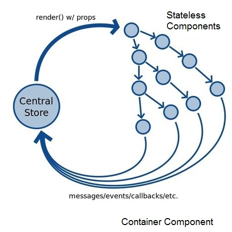

title: Learning React
output: presentation.html
controls: true

--
# Learning


## The Hacker's Way

--
### JavaScript Primer

* JavaScript - What about It?
* Evolving - ECMAScript 6 (ES6)
* Functional Programming
* Async Programming (callback functions)

--
### React JS

* A JavaScript library to build UI
* Based on component not template
* Virtual DOM

--
### React Component

* State
* Props
* Rendering (whenever state or props change)
* Component life cycle events


--
### React Component - <a href="http://jsbin.com/wibepuhoza/edit?html,js,output" target="_blank">An Example</a>

```
// Definition of a React component
const Counter = React.createClass({

  // Component state initializer
  getInitialState() {
    return {count: this.props.initialCount}
  },

  // Rendering component UI
  render() {
    return (
      <button onClick={this.handleClick}>
        {this.state.count}
      </button>
    )
  },

  // Callback function to handle Click event
  handleClick(event) {
    this.setState({count: this.state.count+1})
  },
})

// Rendering component onto web page
ReactDOM.render (
  <Counter initialCount={0}/>,
  document.getElementById("app")
)

```

--
### Defining React Component using React.createClass() Function (ES6)

```
const Counter = React.createClass({
  // Declare prop types
  propTypes: {
    initialCount: React.PropTypes.number
  },

  // Component state initializer
  getInitialState() {
    return {count: this.props.initialCount}
  },

  // Rendering component UI
  render() {
    return (
      <button onClick={this.handleClick}>
        {this.state.count}
      </button>
    )
  }
  
  ...

})
  
```

--
### Defining React Component by extending React.Component (ES6)

```
class Counter extends React.Component {
   // Declare prop types
  propTypes: {
    initialCount: React.PropTypes.number
  }

  // Constructor function - called only once when class object is instantiated
  constructor(props) {
    super(props);
    this.state =  {count: this.props.initialCount};
  }

  // Rendering component UI
  render() {
    return (
      <button onClick={this.handleClick}>
        {this.state.count}
      </button>
    )
  }
  
  ...
  
}

```

--
### Defining React Component using ES6 Stateless Function

```
const Counter = ({count, onIncrement}) => (
  <button onClick={onIncrement}>
    {count}
  </button>
)

// Callback function to be passed to Counter component
const handleCounterIncrement = (event) => {
  // update store.count
  ...
}

ReactDOM.render(
  <Counter count={store.count} onIncrement={handleCounterIncrement} />,
  mountingElement
)

```

--
### React Application Architecture




--
# Exercise Time


--
### Exercise 1 

Create a simple tally-counter app with a React component. <a href="http://jsbin.com/cigebonuhi/edit?html,js,output" target="_blank">(JsBin Link)</a>

Requirements:
- The UI of the app is a button that shows the tally count.
- When the button is left-clicked, the count will increment by 1 and the updated count will be shown in the UI.
- When the button is right-clicked, the counter will be reset to 0.


--
### Exercise 2 

Add a functionality to the prior tally-counter app to allow user to configure initial count. <a href="http://jsbin.com/maboxuyaja/edit?html,js,output" target="_blank">(JsBin Link)</a>

Requirements:
- All the requirements of Exercise 1.
- The initial count is configurable by user.


--
### Exercise 3 

Develop a React app that has a group of counters and calculates the sum of all counters' tally. <a href="http://jsbin.com/qiqogabusu/edit?html,js,output" target="_blank">(JsBin Link)</a>

Requirements:
- A Counter component can be added dynamically to the UI by clicking on a button.
- Another button to allow user to remove all counters.
- Each Counter component can increment and reset its own count independently.
- A Summary component that keeps track of the total of all counters' count.


--
### Excercise 4 - A Todo App
<a href="http://jsbin.com/saxiwunefi/edit?html,js,output" target="_blank">(JsBin Link)</a>

- An input component to allow user add to todo items
- Show a list of Todo components that represent the todo items
- A click on the Todo component will change its status from 'Active' to 'Finished', or vice versa
- Right-clicking on a Todo component will delete its represented todo item
- A Filter component that will show todos based on their status: 'All', 'Active', or 'Finished'

--
### Excercise 5 - A Knowledge Base App
<a href="http://jsbin.com/mukofidiha/edit?html,js,output" target="_blank">(JsBin Link)</a>

Given a partially finished Kowledge Base application, enhance it by adding the following functionalities:
- Allow user to create new knowledge base article
- Allow user to edit an article and save the changes made
- Allow user to delete an existing article from the knowlege base

